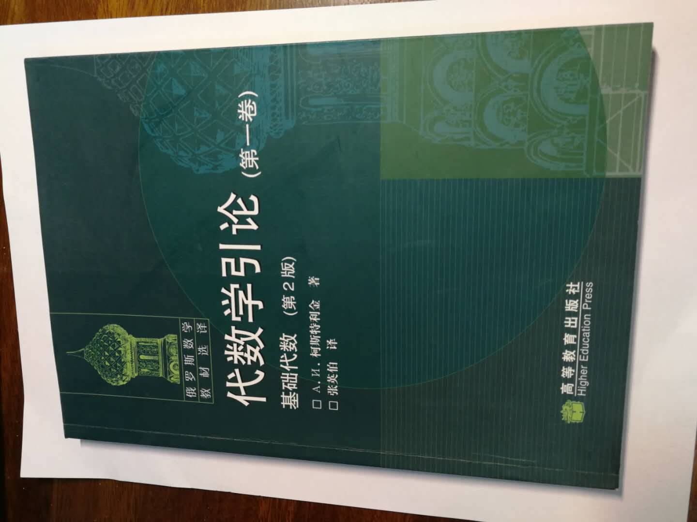
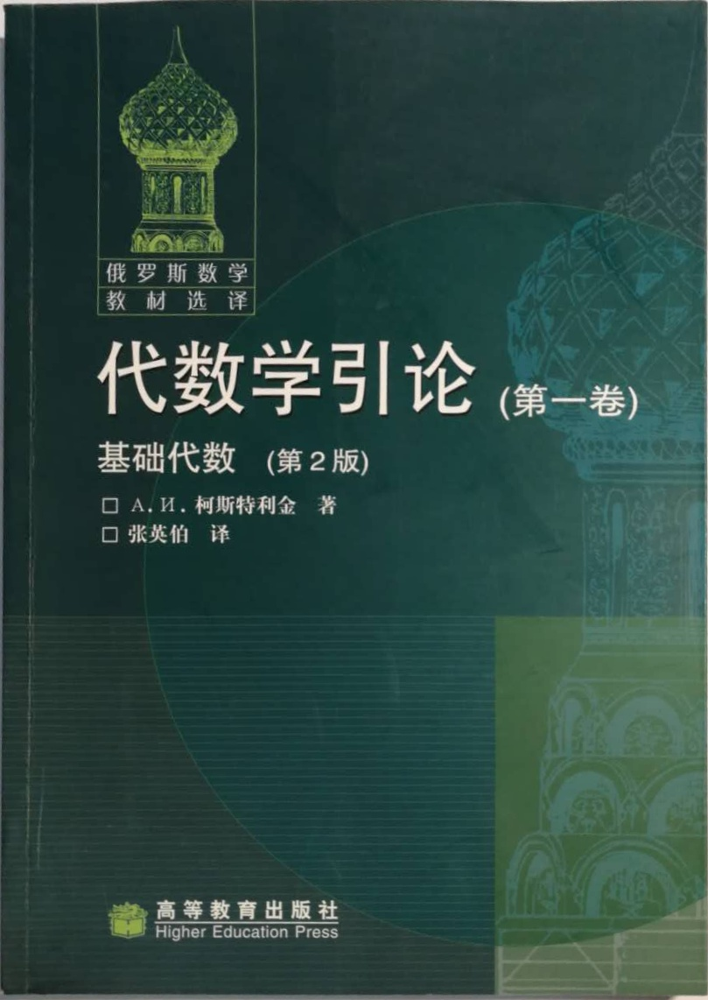

# 文档透视矫正

## 简介

基于哈夫变换拟合直线的方法，检测透视图像中的矩形文档，并对其进行矫正。实际效果比较菜，欢迎交流学习。

博客地址：[https://blog.csdn.net/u010393510/article/details/117754541](https://blog.csdn.net/u010393510/article/details/117754541)

<div align=center>
</div>

## 运行方式

### 一、安装Python环境

### 二、安装Opencv

打开命令行，通过pip命令安装：

```bash
pip install opencv-contrib-python
```

### 三、运行脚本

`imgs`文件夹中有一些示例图片，可以直接运行脚本：

```bash
python doc_rectify.py
```

要查看其他示例图像矫正结果，用编辑器打开`doc_rectify.py`，找到如下行代码：

```python
img_info = img_list[0]   # ***修改此处索引以得到各图片矫正结果***
```

修改索引值并再次运行。

结果图像将输出为`imgs/*_warped.jpg`。
